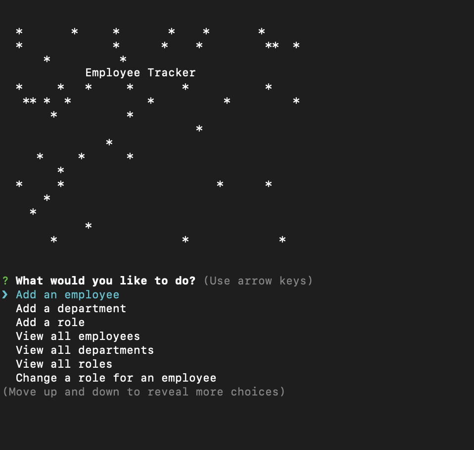

# Homework 12: Employee Tracker CLI Application

This is a basic solution for managing a company's employees. This type of application is also generically known as a **C**ontent **M**anagement **S**ystem. It allows you to view and interact with information stored in a database. The repo provides a schema.sql and seeds.sql file to set up a basic database.

  

## This application uses:

* [MySQL](https://www.npmjs.com/package/mysql) NPM package to connect to the MySQL database and perform queries.

* [InquirerJs](https://www.npmjs.com/package/inquirer/v/0.2.3) NPM package to interact with the user via the command-line.

* [console.table](https://www.npmjs.com/package/console.table) to print MySQL rows to the console.

## Functionality:

To tun the application, run `npm install`, then run `node main.js`.
Basic functionality:

  * Add departments, roles, employees

  * View departments, roles, employees

  * Update employee roles

Bonus functionality (may not be implemented, but don't count on it):

  * Update employee managers

  * View employees by manager

  * Delete departments, roles, and employees

  * View the total utilized budget of a department -- ie the combined salaries of all employees in that department

## Database Schema:

* **department**:

  * **id** - INT PRIMARY KEY
  * **name** - VARCHAR(30) to hold department name

* **role**:

  * **id** - INT PRIMARY KEY
  * **title** -  VARCHAR(30) to hold role title
  * **salary** -  DECIMAL to hold role salary
  * **department_id** -  INT to hold reference to department role belongs to

* **employee**:

  * **id** - INT PRIMARY KEY
  * **first_name** - VARCHAR(30) to hold employee first name
  * **last_name** - VARCHAR(30) to hold employee last name
  * **role_id** - INT to hold reference to role employee has
  * **manager_id** - INT to hold reference to another employee that manager of the current employee. This field may be null if the employee has no manager

## This application uses:

* [MySQL](https://www.npmjs.com/package/mysql) NPM package to connect to your MySQL database and perform queries.

* [InquirerJs](https://www.npmjs.com/package/inquirer/v/0.2.3) NPM package to interact with the user via the command-line.

* [console.table](https://www.npmjs.com/package/console.table) to print MySQL rows to the console. There is a built-in version of `console.table`, but the NPM package formats the data a little better for our purposes.

